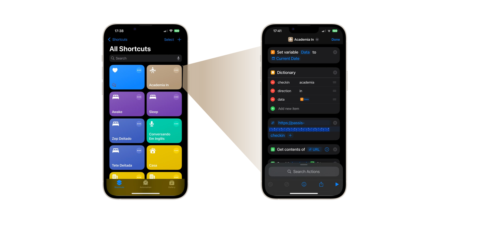

## Passis - Meu Assistente Pessoal
##### Aluno: Otávio Ciribelli Borges (https://github.com/ciribelli) 
##### Orientador: Anderson Nascimento (https://github.com/insightds)
##### Matrícula: `221101073` Pontifícia Universidade Católica do Rio de Janeiro Curso de Pós-Graduação *Business Intelligence Master*


## Resumo
Este trabalho visa apresentar uma abordagem inovadora para apropriação e uso dos dados gerados diariamente por cada indivíduo em múltiplos propósitos e contextos. Em contraste com o paradigma que grandes corporações comumente oferecem enquanto experiência para seus usuários, a proposta desta solução de Assistente Pessoal (Passis) se diferencia pelo gerenciamento das informações pessoais de forma segura e em formato aberto e flexível quanto à forma de consumo e utilização desses dados. Neste contexto, o Passis objetiva uma rotina de maior produtividade para seus usuários por meio do aumento do conhecimento de suas próprias informações que são geradas e armazenadas pelo sistema. Com uma inovadora forma de combinação dos dados pessoais registrados com as informações do meio onde o indivíduo está inserido, a solução habilita que decisões sejam tomadas em tempo real com menor grau de subjetividade. O Assistente foi desenvolvido em um conjunto de implementações modeladas em formato de microsserviços com uma Interface Programável de Aplicação (API) que comunica com rotinas automatizadas e comandos do usuário que acontecem preferencialmente em linguagem natural pelo aplicativo de mensagem Whatsapp. Sendo seu código-fonte desenvolvido em formato aberto (*open source*), pode ser implementado em diferentes plataformas e conectado com os principais serviços de visualização de dados e plataformas de *Business Inteligence* disponíveis no mercado. 


## Abstract


This work aims to present an innovative approach for the appropriation and use of data generated daily by each individual for multiple purposes and contexts. In contrast to the paradigm commonly offered by large corporations as a user experience, the proposed solution of a Personal Assistant (Passis) stands out for securely managing personal information in an open and flexible format regarding how the data is consumed and applied. In this context, Passis aims to promote a more productive routine for its users by increasing their awareness of their own information, which is generated and stored by the system. With an innovative way of combining recorded personal data with information from the environment in which the individual is embedded, the solution enables real-time decision-making with a lower degree of subjectivity. The Assistant was developed using a set of implementations modeled as microservices with an Application Programming Interface (API) that communicates with automated routines and user commands, preferably in natural language through the messaging app WhatsApp. As its source code is developed in an open-source format, it can be implemented on different platforms and connected to major data visualization services and Business Intelligence platforms available on the market.
## 1. Introdução
### 1.1 Contextualização
Uma discussão importante que se intensificou na última década é a questão da soberania e uso dos dados pessoais. Não é incomum vermos ações judiciais entre grandes corporações globais e países que buscam esclarecimento sobre a propriedade e o uso não-consentido de dados de cidadãos e instituições, sejam governamentais ou não. No campo individual, pessoas se submetem à uma realidade aparentemente imutável onde o acesso à recursos e lugares se dá apenas e exclusivamente sob a condição de sessão de seus dados pessoais. Ao consentir diariamente com novas políticas de termos e condições, empresas privadas e autoridades públicas fazem uso de dados pessoais em uma escala sem precedentes para realizar suas atividades [[1]](#5-referências).

Para além da segurança dos dados, que certamente é o tópico de maior importância no contexto da discussão, existe uma segunda temática ligada ao uso efetivo das informações que são geradas diariamente por indivíduos. Diferentes fontes que podem ser encontradas na internet versam sobre o volume de dados que são gerados diariamente por pessoas. Um desses estudos, publicado pela empresa Edge Delta* que é especializada em estudos de tendência sobre geração de dados, afirma que o volume médio diário de dados produzidos por uma pessoa usuária de internet [[2]](#5-referências) é da ordem de 146.880 MB.  

Paralelamente à corrida pelo "novo ouro" que são os dados privados de indivíduos e corporações, no final de novembro de 2022 ganhou notória publicidade uma aplicação conversacional que utiliza o modelo denominado GPT-3 lançado em dezembro daquele ano pela empresa OpenAI. Baseado na também popular publicação "Atention is all you need" (Vaswani, A. et al [[3]](#5-referências)) que propôs em o modelo de Transforms, tal lançamento surpreendeu o mercado de tecnologia com uma capacidade até então desconhecida de agregação e manipulação de dados, trazendo um novo paradigma para uma efetiva aplicação das informações geradas digitalmente. 

A mudança de paradigma é tamanha que, de acordo com o documento *Top Strategic Technology Trends for 2025: Agentic AIS* [[4]](#5-referências), pelo menos 15% das decisões cotidianas de trabalho serão tomadas de forma autônoma por meio de IA agentiva, um aumento em relação a zero por cento em 2024.


_Figura 01 - Aumento do interesse por soluções do tipo “AI Personal Assistant”, segundo informações do site Google Trends_

### 1.2 Motivação
Suponhamos que alguém decida fazer uma promessa de ano novo comprometendo-se a dormir mais cedo no ano que se inicia, na busca por uma vida mais equilibrada e saudável. Ou ainda, uma pessoa se comprometa em fazer caminhadas diárias para melhorar seu desempenho cardiorespiratório. Ou por último, alguém busque por uma sugestão de programação para uma tarde de sábado de acordo com suas preferências e as condições climáticas daquele dia. Naturalmente, cada uma dessas pessoas poderia buscar um aplicativo de caminhadas, baixar um monitor de sono para seu _smartwatch_ ou fazer uma busca numa rede social ou portal de eventos para saber a programação de jogos naquela tarde. Acontece que, todas essas são informações que estão persistidas de forma estanque em suas origens, com pouca ou nenhuma personalização de conteúdo para atender a real necessidade desses indivíduos. O aplicativo de caminhadas irá calcular o ritmo de caminhada, apresentar o tempo e a velocidade média num _dashboard_. Um mapa também será exibido para que as pessoas interajam com sua caminhada. Em verdade, o que se desejava com o aplicativo era apenas saber se as caminhadas estão sendo mais frequentes neste ano quando comparadas ao ano anterior. Tal raciocínio vale para o aplicativo de sono e o site de busca por entretenimento. Eventualmente, num dia chuvoso e com um clássico de futebol exibido na TV aberta envolvendo seu time do coração, poderia ser essa a sugestão que mais agrada quem procura o que fazer com seu tempo.

Muito provavelmente, a pergunta que se quer responder neste trabalho, em meio à vastidão de informações geradas diariamente por pessoas e sistemas, é: *qual o melhor recorte de dados que deve ser consultado para prover a resposta mais adequada para uma determinada necessidade*?

### 1.3 Proposição

A proposta deste trabalho, neste contexto de altíssima disponibilidade de dados e recursos tecnológicos que permitem imensa agregação de informações de diferentes origens em modelos de linguagem de larga escala, consiste em propor um assistente pessoal que forneça sugestões em assuntos de domínio das memórias particulares, localização geográfica, compromissos (checkins), clima, trânsito e eventos externos. 

Para o assistente Passis, contrariando a estatística da montanha de dados que se estima que seja gerada por pessoas diariamente, destinou-se apenas 11kB por dia, em média, para a geração de sua base de dados.

Em linha com o objetivo de garantir maior produtividade ao usuário, a interface gráfica definida para este assistente é um contato de Whatsapp que permitirá um foco mais contínuo às atividades, evitando alternâncias demasiadas de telas e emulando uma pessoa como outra qualquer de sua lista de contatos.


_Figura 02 - Visualização da interface como um contato pessoal no aplicativo Whatsapp da Meta._

## 2. Modelagem
A arquitetura do sistema é composta por um _backend_ desenvolvido em Python por meio de um servidor web que implementa o _framework_ Flask que gerencia as rotas e _endpoints_, um conjunto de funções de processamento e busca, e um modelo de linguagem de larga escala (LLM) que gera as respostas contextuais. Além do servidor principal, um banco de dados Postgres também suporta o funcionamento da aplicação guardando as informações do usuário relativamente a memórias, documentos, compromissos ("checkins") etc. A *Figura 03* apresenta um panorama da visão funcional do sistema.


_Figura 03 - Diagrama funcional do Passis._
### Interface de comunicação

Por ser um sistema baseado em API, a interface para entrada e saída de dados pode ser agnóstica à plataformas ou tecnologias específicas. Quatro diferentes modalidades de interação intencional com o sistema podem ser destacadas:
- **Entrada manual**: realizada por meio de chamadas aos endpoints da API, utilizando um navegador, ferramentas de gerenciamento de APIs (como o Postman, entre outras disponíveis no mercado), ou componentes que utilizem o protocolo HTTP. Nesta modalidade, os argumentos de entrada podem ser definidos livremente pelo usuário que manipula a API.
- **Entrada estática**: realizada por meio de comandos pré-definidos no contato Passis do Whatsapp. Nesta modalidade, os argumentos de entrada das funções da API são pré-definidos e imutáveis.
- **Entrada dinâmica**: realizada por meio de comandos de texto livre ou mensagens de áudio no contato Passis do Whatsapp. Nesta modalidade, o modelo de linguagem interpreta a entrada do usuário e define os argumentos da API de forma dinâmica.
- **Entrada via botão**: automação que, baseada no clique de um botão, insere informações no sistema.

Cabe destacar que a _Entrada dinâmica_ vale-se do conceito de **Agentes** que será melhor detalhada na sessão [Implementação do Backend](#implementação-do-backend).

Além das interações de natureza intencional, existem também comandos programáticos previstos para cumprir com o objetivo de utilizar os dados do usuário de forma transparente. São dois tipos de entradas programáticas implementadas no Passis utilizando a função `Atalhos` disponível no iOS:
- **Entrada agendada**: automação que regularmente e, em horários pré-definidos, insere informações no sistema. Um exemplo é a localização e as informações climáticas do usuário em determinado instante.
- **Entrada geolocalizada**: automação que, baseada na localização do usuário, insere informações no sistema. Um exemplo é a inserção de um `checkin` no momento em que o usuário chega ao seu escritório para trabalhar.

Entradas agendadas ou geolocalizadas também poderiam ser implementadas em diferentes sistemas operacionais.


_Figura 04 - Entrada via botão: exemplo de um usuário que monitora o número de vezes em que pratica atividade física._

### Implementação do Backend
As sessões a seguir resumem os arquivos `.py` e seus respectivos módulos que compõem a arquitetura do Passis.
#### app.py
- Este arquivo é a entrada principal do aplicativo Flask. Nele estão contidas as rotas e endpoints da API e é onde estão definidas as classes e respectivos métodos do banco de dados Postgres desta solução. Há uma implementação de importante destaque do sistema que é uma estrutura tipicamente reconhecida como _webhook_. Este trecho do código funciona como um ponto de espera e conexão ativa com a API da Meta e seu aplicativo Whatsapp Business. Portanto, ainda que o conceito de arquitetura contemple a propriedade de agnosticidade à interface por usar exclusivamente as rotas e endpoints do arquivo app.py para seu funcionamento, neste webhook é onde acontece a implementação desta prova de conceito que foi feita utilizando o Whatsapp enquanto interface de usuário.
- Uma lista completa das rotas e endpoints do arquivo app.py estão listadas na tabela a seguir:

| Rota                                | Métodos          | Descrição                                                         |
|-------------------------------------|------------------|-------------------------------------------------------------------|
| /                                   | GET              | Página inicial do servidor                                        |
| /v1/jogos/<data_hora>               | GET              | Obtém jogos para uma data/hora específica (Central de jogos UOL)  |
| /v1/time/<nome_time>                | GET              | Obtém informações sobre um time específico (Central de jogos UOL) |
| /v1/x/                              | GET              | Busca informações de um perfil no X (antigo Twitter)              |
| /v1/clima                           | GET              | Obtém informações climáticas (API Clima Tempo)                    |
| /webhook                            | POST, GET        | Webhook para interações (POST) e verificações (GET) com a Meta    |
| /checkin                            | POST, GET        | Cria (POST) ou lista (GET) check-ins                              |
| /checkin/<checkin_id>               | GET, PUT, DELETE | Obtém, atualiza ou deleta um check-in específico                  |
| /adicionar_clima                    | POST             | Adiciona dados climáticos                                         |
| /deletar_clima/<clima_id>           | DELETE           | Deleta um registro climático específico                           |
| /criar_documento                    | POST             | Cria um novo documento binário                                    |
| /recuperar_documento/<documento_id> | GET              | Recupera um documento binário específico                          |
| /recuperar_lista_documentos         | GET              | Lista todos os documentos binários                                |
| /excluir_documento/<documento_id>   | DELETE           | Exclui um documento binário específico                            |
| /atualizar_documento/<documento_id> | PUT              | Atualiza informações de um documento binário                      |
| /memorias                           | POST, GET        | Cria (POST) ou lista (GET) memórias                               |
| /threads                            | GET              | Obtém as últimas threads (conversas) registradas no Passis        |

#### main.py
- Este arquivo tem por objetivo implementar módulos de busca e manipulação de informações mais intensas, que podem envolver consulta à APIs externas ou atividades de _webscraping_ feitas para o propósito do Passis.
- As funções do arquivo estão listadas na tabela abaixo. Cabe observar que o formato de retorno pode ser flexível para permitir diferentes abordagens nas consultas aos modelos de linguagem. Um ponto de atenção neste tipo de abordagem é que o desempenho dos modelos de linguagem pode variar muito quando submetido a informações com diferentes formatações (`JSON`, texto livre, Pandas `DataFrame`, dentre outras). Por esta razão, alguns métodos são implementados retornando a mesma informação em formatos diferentes.

| Função       | Descrição                                                                                                                                                                                              | Tipo de Retorno   |
|--------------|--------------------------------------------------------------------------------------------------------------------------------------------------------------------------------------------------------|-------------------|
| nucleo_jogos | Busca e filtra informações sobre jogos de futebol em uma data específica, retornando um DataFrame com os dados dos jogos.                                                                              | DataFrame         |
| get_jogos    | Chama a função `nucleo_jogos` e retorna um DataFrame com colunas específicas dos jogos em formato JSON.                                                                                                | JSON              |
| get_jogos_df | Chama a função `nucleo_jogos` e retorna uma string formatada com informações dos jogos e um DataFrame com colunas específicas dos jogos.                                                               | Texto, JSON       |
| get_time     | Filtra jogos de um time específico utilizando o DataFrame completo retornado pela função `nucleo_jogos`.                                                                                               | JSON              |
| filtro_jogao | Retorna o número de jogos considerados "grandes jogos" (isBigGame) no DataFrame retornado pela função `nucleo_jogos`.                                                                                  | Inteiro           |
| busca_X      | Utiliza a API do Google para buscar informações no Twitter sobre um perfil específico e retorna uma string formatada com os resultados e um dicionário com os dados dos tweets.                        | Texto, Dicionário |
| busca_Clima  | Utiliza a API do Clima Tempo para buscar informações em tempo real sobre o clima na cidade do Rio de Janeiro e retorna uma string formatada com os dados do clima e a resposta da API em formato JSON. | Texto, JSON       |


#### chathub.py

- Este arquivo é responsável pelo fluxo de comunicação e interação do usuário, gerenciando as informações recebidas e indicando as ações a serem tomadas com base no conteúdo da mensagem.
- O termo 'hub' se refere às múltiplas interações que este módulo do sistema realiza desde o recebimento das mensagens do _Webhook_, triagem das informações para entender a natureza do conteúdo (se áudio ou texto, por exemplo) e conexões com o modelo de linguagem e funções de mensageria. Pode-se dizer que sua função é também garantir que o usuário receba alguma resposta para toda e qualquer interação.
- Existem comandos textuais específicos (`Entrada estática`) que são funcionais e permitem atuar diretamente no sistema, conforme listagem na tabela abaixo:


| Comando/Texto                    | Explicação                                                                           |
|----------------------------------|--------------------------------------------------------------------------------------|
| `jogos` ou `jogo`                | Obtém informações sobre jogos para a data atual                                      |
| `cidade`, `cidades` ou `transito` | Busca informações sobre a cidade e trânsito no X (antigo Twitter)                    |
| `Clima`, `Climas`, `clima` ou `climas` | Busca informações sobre o clima                                                      |
| `checkin`                        | Obtém informações de check-ins dos últimos 4 dias até a data atual                   |
| `localização` ou `localizacao`   | Obtém a cidade atual e informações sobre o clima dos últimos 4 dias até a data atual |
| `📝`                             | Salva na memória as informações contidas na mensagem                                 |
| `🔄`                             | Força a atualização dos vetores de embeddings                                        |
| `responder`                      | Ativa o modo de pergunta, enviando uma questão ao usuário                            |
| `✅`                               | Mensagem reservada do sistema para evitar o envio do prompt para a API OpenAI        |

- Para o caso de comandos via linguagem natural, sejam estes recebidos via texto ou áudio, o chathub.py faz com que estes comandos cheguem ao módulo da API da OpenAI via comando 'envia_prompt_api'.

#### context_gpt35turboFuncCalling.py

- O arquivo context_gpt35turboFuncCalling.py é o responsável por criar contextos e responder perguntas usando os modelos de linguagem da OpenAI. 
- A função _create_context_ é essencial para a criação de contextos relavantes para perguntas específicas com base nas informações pessoais de memórias e documentos. Além da ordenação com prioridade de menor distância vetorial implementada utilizando o modelo _text-embedding-ada-002_, o método também guarda as tabelas e respectivas posições de cada item do contexto para habilitar futuras consultadas e recuperação de documentos binários. Uma atenção especial é dada ao primeiro item da lista que é salvo na variável global _first_item_. O código de busca contextual está transcrito abaixo: 
```python
def create_context(question, df, max_len=1200, size="ada"):
    load_dotenv()
    client.api_key = os.getenv('OPENAI_API_KEY')
    # Recupera os embeddings para a pergunta em formato dataFrame - função não documentada pela opeanAI
    q_embeddings = client.embeddings.create(input=question, model='text-embedding-ada-002').data[0].embedding
    df["distances"] = df["embeddings"].apply(lambda x: cosine(q_embeddings, x))

    returns = []
    links = []
    cur_len = 0

    # Ordena por distâncias e adiciona o texto para ao contexto respeitando o máximo tamanho configurado em max_len
    for i, row in df.sort_values('distances', ascending=True).iterrows():
        # Adiciona o tamanho do texto ao current length do contexto
        cur_len += row['n_tokens'] + 4
        # Interrompe se o contexto já é longo o suficiente
        if cur_len > max_len:
            break
        # Adiciona o texto que será retornado / adiciona também informações da tabela e o índice correspondente para futura recuperação
        returns.append(row["texto"])
        links.append(str(row["tabela"])+'/'+str(row["index"]))

    global first_item
    # Guarda a posição do primeiro item de menor distância da pergunta
    first_item = links[0]
    # Retorna o contexto
    return "\n🤖\n".join(returns)
```
- a função _answer_question_ é o principal componente deste módulo, integrando modelos de linguagem como núcleo inteligente e delegando a agentes especializados tarefas específicas, como buscar informações, executar ações e interagir com APIs, além das rotas definidas nos módulos app.py e main.py. Seu objetivo é oferecer respostas e soluções personalizadas, baseando-se no contexto pessoal construído pela função _create_context_. Para garantir um nível de qualidade satisfatório nas respostas, diferentes modelos podem ser chamados de forma recursiva dentro dessa função. 
- a função _audio_transcription_ também é executada neste módulo, que após o recebimento e transcrição da mensagem de áudio, recebe o tratamento textual padrão previsto para as mensagens de texto.
embeddings_db.py.
- Os agentes são considerados o estado da arte na implementação de modelos de larga escala. No contexto do Passis, a abordagem de agentes foi implementada utilizando a funcionalidade `functions` da OpenAI. A tabela abaixo resume os agentes disponíveis no Passis e suas respectivas funções:

| Nome do Agente          | Descrição                                                                                                                         | Parâmetros Necessários                                          |
|--------------------------|-------------------------------------------------------------------------------------------------------------------------------------|------------------------------------------------------------------|
| `busca_Jogos`           | Busca uma lista de jogos de futebol para uma data específica.                                                                      | `date` (formato `dd-mm-yyyy`)                                   |
| `obter_cidade_atual_e_clima` | Retorna informações sobre a localização atual do usuário e o clima na região, considerando um intervalo entre uma data e a atual. | `date` (formato `dd-mm-yyyy`)                                   |
| `busca_Checkin`         | Busca uma lista de checkins do usuário em um intervalo de datas. Checkins incluem atividades como acordar, academia, etc.           | `date` (formato `dd-mm-yyyy`)                                   |
| `ultimo_Checkin`        | Retorna detalhes do último checkin realizado pelo usuário, como tipo, horário e direção.                                           | Nenhum                                                         |
| `busca_Clima`           | Obtém informações em tempo real sobre o clima da cidade do Rio de Janeiro, como temperatura, precipitação e vento.                 | Nenhum                                                         |
| `busca_Cidade`          | Fornece dados em tempo real sobre o trânsito e eventos na cidade do Rio de Janeiro, baseados no Centro de Operações Rio.            | Nenhum                                                         |
| `registra_Memoria`      | Permite salvar informações personalizadas na memória persistente do sistema, conforme solicitado pelo usuário.                      | Nenhum                                                         |

#### embeddings_db.py

- trata-se de um módulo de suporte responsável pela atualização e gerenciamento de embeddings em articulação com o banco de dados Postgres.
- as principais funções do módulo são o `update_embeddings_db`, que calcula efetivamente os vetores de _embeddings_ para os registros das informações em banco de dados e a função `atualiza_embedding`, que recupera as informações atualizadas das tabelas de interesse do banco de dados em formato _Data Frame_.

#### send_msg.py

- trata-se de um módulo de mensageria responsável pelo envio de mensagens via WhatsApp.
- as principais funções do módulo são: `send_wapp_msg`, que envia mensagens de texto; `send_wapp_question`, que envia perguntas interativas; `send_wapp_audio_reply`: gerencia as mensagens de áudio e responde com perguntas sugestivas para transcrever ou memorarizar as mensagens; `send_wapp_image`e `get_url_wapp_media`, que juntas permitem o envio de documentos para o usuário.


## 3. Resultados
Os resultados da combinação de (i) dados públicos, utilizados para treinar os modelos fundacionais de larga escala, (ii) dados pessoais, armazenados no banco de dados passisdb e (iii) dados em tempo real, recuperados no momento do uso da aplicação Passis, indicam potencial de integração eficiente entre essas fontes de informação. O assistente Passis foi utilizado experimentalmente por cerca de um ano, durante o qual aprimoramentos e novas funcionalidades foram gradualmente incorporados.

As demonstrações dos resultados foram realizadas utilizando o WhatsApp como interface de consulta. Para diferentes tipos de entrada, os resultados foram agrupados de acordo com a natureza do benefício gerado para o usuário, permitindo uma análise estruturada dos impactos observados.
### 3.1 Ganhos de produtividade
- *Situação*: para realizar uma reserva de hotel, informações diversas tais como: nome completo, CPF, e-mail, endereço, data de nascimento etc. são solicitadas ao usuário;
- *Uso*: usuário insere as informações solicitadas no prompt de texto do Passis,  acrescidas de uma simples instrução que solicita o preenchimento dos campos;
- *Resultado*: as informações demandadas são selecionadas por similaridade semântica à partir dos registros contidos no banco de dados Passisdb. A busca vetorizada carrega as informações de maior correspondência no contexto que é passado para o modelo conversacional. O retorno da função é o texto preenchido que então é apresentado na tela do usuário conforme abaixo. 


- *Situação*: usuário necessita da data de expiração de seu passaporte;
- *Uso*: usuário solicita diretamente no prompt a informação desejada, mencionando o documento e o campo;
- *Resultado*: as informações demandadas são selecionadas por similaridade semântica e os documentos com maior correspondência são listados nas primeiras posições. Os metadados dos documentos de maior correspondência são passados para o modelo conversacional. Neste caso, em específico, a posição de memória do documento de maior relevância é guardada e enviada para uma segunda função que recupera a imagem do documento da memória. Tanto a resposta objetiva textual, quanto o documento de maior probabilidade de ocorrência, são apresentados ao usuário na tela do assistente.


- *Situação*: usuário dispõe de informação em formato de áudio (mp3, mp4, wav ou similar)
- *Uso*: usuário pode enviar diretamente ou encaminhar uma mensagem com conteúdo de áudio para o assistente
- *Resultado*: assistente recebe a mensagem e inicia a transcrição do áudio, que pode acontecer de forma multilíngue. Assistente retorna mensagem transcrita com duas opções: (i) memorizar aquela informação na memória de longo prazo ou tomar uma ação com o trecho de texto transcrito. Na sequência, o usuário pode selecionar no próprio assistente qual caminho deve ser seguido, dando continuidade a interação de forma escrita ou falada.


### 3.2 Ganhos de desempenho pessoal
- *Situação*: usuário precisa saber se tem sido bem-sucedido na sua meta de acordar mais cedo
- *Uso*: usuário solicita ao assistente uma análise estatística sobre o horário que tem acordado indicando um horizonte de tempo determinado
- *Resultado*: as informações demandadas são direcionadas para o agente que é capaz de lidar com informações do tipo 'checkin' do usuário (busca_Checkin). Com base no texto enviado, o agente é capaz de extrair as datas de início e fim do período indicado e passá-las como argumento para a função que recupera as informações do banco de dados passisdb (tabela 'checkins'). Então, as informações são passadas para o modelo conversacional juntamente com outras informações de contexto, para permitir uma resposta completa e direcionada ao propósito pretendido. O assistente Passis retorna para a tela de interface as informações desejadas.


### 3.3 Busca Geolocalizada em tempo real
- *Situação*: usuário precisa entender as oscilações térmicas pelas cidades por onde esteve cidades e temperaturas por onde estive
- *Uso*: usuário solicita ao assistente uma análise estatística sobre o horário que tem acordado indicando um horizonte de tempo determinado
- *Resultado*: as informações demandadas são direcionadas para o agente que é capaz de lidar com informações que envolvem clima e geolocalização (obter_cidade_atual_e_clima). Com base no texto enviado, o agente é capaz de extrair as datas de início e fim do período indicado e passá-las como argumento para a função que recupera as informações do banco de dados passisdb (tabela 'climas'). Então, as informações são passadas para o modelo conversacional juntamente com outras informações de contexto, para permitir uma resposta completa e direcionada ao propósito pretendido. O assistente Passis retorna para a tela de informações desejadas.

- *Situação*: usuário evita uma rota em razão de acidente ou evento acontecendo na cidade 
- *Uso*: usuário solicita ao assistente informações específicas sobre um local da cidade (túnel Rebouças no Rio de Janeiro)
- *Resultado*: as informações demandadas são direcionadas para o agente que é capaz de realizar buscas no X. Neste caso específico, é utilizado o perfil do Centro de Operações Rio (@OperacoesRio). Este agente retorna para a função uma lista com horários e acontecimentos ocorridos na cidade do Rio de Janeiro nas últimas horas. Com base nessas informações, o assistente Passis retorna, em forma de texto livre, uma mensagem correspondendo aos eventos solicitados.


### 3.4 Busca em tempo real com preferências pessoais
Situação: usuário recebe informação em tempo real com base em suas preferências registradas em memória
Uso: usuário solicita ao assistente informações sobre jogos de futebol do dia seguinte, informando o apelido do seu time de futebol
Resultado: as informações demandadas são direcionadas para o agente _busca_Jogos_, que é capaz de buscar uma lista de jogos para um dia específico, além de saber inferir a data de interesse à partir do dia solicitado pelo usuário. Paralelamente, são ordenadas por similaridade as memórias relacionadas ao tema da pergunta; sendo neste caso um jogo de futebol, a primeira memória associada traz informações sobre o time de preferência do usuário. A função _main.get_jogos_ é então solicitada para a data de interesse e retorna a lista de jogos para a data informada enquanto argumento de entrada. Uma nova chamada é então realizada para o modelo de linguagem, que recebe a lista completa de jogos daquele dia, juntamente com as memórias relacionadas na primeira busca realizada neste processo. Com todas essas informações, o modelo retorna com as informações do jogo solicitado.


## 4. Conclusões
O desenvolvimento do **Passis** - Meu Assistente Pessoal - demonstrou ser uma solução inovadora e eficaz para a gestão de dados pessoais de forma segura e personalizada. Ao longo deste projeto, foi possível observar que a combinação de dados públicos, pessoais e em tempo real pode proporcionar ganhos significativos em produtividade e desempenho pessoal. A utilização de uma interface amigável, como o WhatsApp, e a implementação de microserviços e APIs abertas, permitiram uma interação fluida e eficiente com o usuário.

Os resultados obtidos durante o período experimental indicam que o Passis pode ser uma ferramenta valiosa para auxiliar na tomada de decisões diárias, oferecendo sugestões personalizadas e relevantes com base nas informações armazenadas e no contexto atual do usuário. A capacidade de integrar dados de diferentes fontes e apresentar respostas contextuais em tempo real destaca o potencial do Passis frente a outros assistentes pessoais disponíveis no mercado.

Em suma, o Passis representa um avanço significativo na forma como os dados pessoais podem ser gerenciados 
e utilizados para melhorar a qualidade de vida dos indivíduos. 
A continuidade deste projeto pode abrir novas possibilidades para a aplicação de inteligência artificial em assistentes pessoais 
também no ambiente profissional [[5]](#5-referências), seja automatizando tarefas manuais ou estendendo a capacidade da força de trabalho atual de empresas ao redor do mundo.


## 5. Referências

[1] [General Data Protection Regulation (GDPR), REGULATION (EU) OF THE EUROPEAN PARLIAMENT AND OF THE COUNCIL - 2016/679](https://eur-lex.europa.eu/legal-content/EN/TXT/PDF/?uri=CELEX:32016R0679)

[2] [Breaking Down The Numbers: How Much Data Does The World Create Daily in 2024? - Mar 11, 2024 By Edge Delta](https://edgedelta.com/company/blog/how-much-data-is-created-per-day#:~:text=An%20internet%20user%20generates%20an%20average%20of%20146%2C880%20MB%20daily.&text=Researchers%20have%20stated%20that%20the,create%20about%20506%2C736%20MB%20daily.)

[3] [Attention is all you need - 2017 By Ashish Vaswani et al](https://proceedings.neurips.cc/paper_files/paper/2017/file/3f5ee243547dee91fbd053c1c4a845aa-Paper.pdf)

[4] [Top Strategic Technology Trends for 2025: Agentic AI - 21 October 2024 - ID G00818765 By Tom Coshow, Arnold Gao](https://www.gartner.com/document-reader/document/5850847?ref=solrAll&refval=440929492)

[5] [The Future of Frontline Work: Collaborative Human-Machine Teams - 3 June 2024 - ID G00785847 By Emily Rose McRae et al](https://www.gartner.com/document/4382299?ref=solrResearch&refval=421781754&)  

